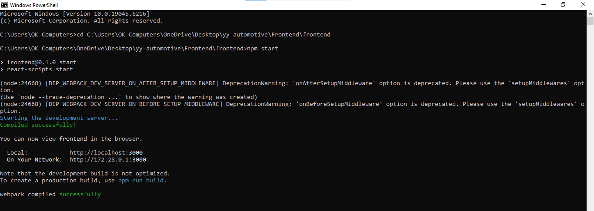

# Y&Y Automotive - Backend

This is the **backend API** for **Y&Y Automotive**, a modern workshop booking and management system.  
Built with **Node.js + Express**, it provides REST APIs for user authentication, service listings, and booking management.  

---

## 🌐 Live API
- 🔗 Base URL: [https://your-backend-live-link.com](https://yy-backend.onrender.com/) *(replace with deployed link if available)*  
- Example Endpoint: `GET /api/bookings`

---

## 📸 Screenshot


*(Add a Postman screenshot or terminal log showing a sample API response.)*

---

## ✨ Features
- User authentication with **JWT**  
- Workshop services API (CRUD)  
- Booking management (create, update, cancel)  
- Secure password hashing with **bcrypt**  
- MongoDB database with **Mongoose**  

---

## 🛠️ Tech Stack
- **Node.js**  
- **Express.js**  
- **MongoDB + Mongoose**  
- **JWT Authentication**  
- **bcrypt**  
- **CORS** enabled  

---

## ⚡ Getting Started

### 1. Clone the repo
```bash
git clone https://github.com/yasirmirza595/yy-backend.git
cd yy-backend
2. Install dependencies
bash
Copy code
npm install
3. Setup environment variables
Create a .env file in the root and add:

ini
Copy code
MONGO_URI=your-mongodb-connection-string
JWT_SECRET=your-secret-key
PORT=5000
4. Run the server
bash
Copy code
npm run dev
Server will start at 👉 http://localhost:5000

📂 Folder Structure
csharp
Copy code
yy-backend/
  ├── src/
  │   ├── controllers/   # Business logic
  │   ├── models/        # Mongoose schemas
  │   ├── routes/        # API routes
  │   ├── middlewares/   # Auth & error handlers
  │   └── server.js      # App entry point
  ├── .env.example       # Example env vars
  ├── package.json       # Dependencies & scripts
🚀 Deployment
Deployed on: Render / Railway / Vercel / Heroku (choose your platform)

📜 License
This project is licensed under the MIT License.
You are free to use, modify, and distribute with attribution.
